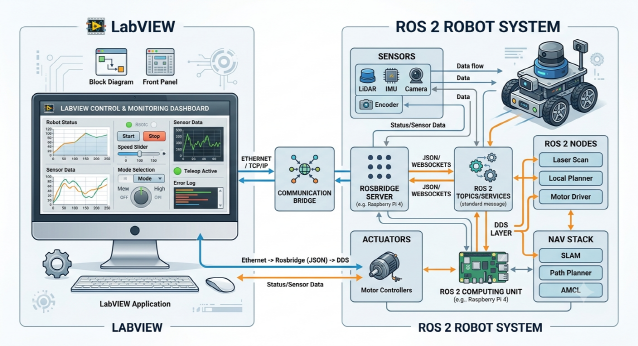

# LabVIEW & ROS/ROS 2 연동 통합 제어 실무 교육 커리큘럼

## 1. 교육 개요

* **교육 과정명**: LabVIEW와 ROS/ROS 2를 활용한 미들웨어 연동 및 로봇 제어 시스템 구축 과정
* **교육 대상**: 
  * LabVIEW를 이용한 데이터 수집 및 UI 개발 경험이 있는 엔지니어
  * ROS 기반 로봇 플랫폼에 NI 제어기(cRIO, myRIO 등) 및 LabVIEW를 연동하고자 하는 연구원 및 개발자
* **교육 기간**: 총 3일 (21시간, 일일 7시간)
* **선수 지식**: LabVIEW 기초 활용 가능자, Linux/ROS 기초 개념 보유자 권장

---

## 2. 교육 목표

1. **ROS 및 ROS 2의 핵심 아키텍처**와 통신 메커니즘(Publish/Subscribe, Service, Action)을 이해합니다.
2. **Rosbridge (WebSocket/JSON)** 기반으로 LabVIEW와 ROS 간의 교차 플랫폼 데이터 통신을 구현합니다.
3. **ROS 2의 DDS(Data Distribution Service)** 구조를 이해하고, LabVIEW 환경에서 직접 DDS 메시지를 전달하는 고성능 연동 기법을 습득합니다.
4. 센서 데이터 시각화, 모터 제어 명령 전달, 모니터링 Dashboard 제작 등 **실무 모듈 프로젝트**를 완성합니다.

---

## 3. 상세 교육 일정 (3일 과정)

### [Day 1] ROS/ROS 2 핵심 및 Rosbridge 연동 기초

* **목표**: ROS 환경 구축, Rosbridge 메커니즘 이해 및 LabVIEW WebSocket 통신 구현

| 시간 | 구분 | 주요 내용 | 실습 및 세부 사항 |
| :--- | :--- | :--- | :--- |
| **09:00~10:30** | 모듈 1 | **ROS & ROS 2 아키텍처 개요** | - ROS 1 vs ROS 2 핵심 차이점 비교 - Node, Topic, Service, Action 개념 정리 |
| **10:30~12:00** | 모듈 2 | **개발 환경 구축 & ROS 명령 실행** | - Ubuntu 환경에서 ROS 2 환경 구성 - 기본 CLI 명령 및 CLI Topic Test (`ros2 topic pub/echo`) |
| **12:00~13:00** | 점심시간 | - | - |
| **13:00~15:00** | 모듈 3 | **Rosbridge Protocol 규격 분석** | - `rosbridge_server` 패키지 설치 및 실행 - JSON 포맷 기반 Topic Publish/Subscribe 프로토콜 분석 |
| **15:00~18:00** | 모듈 4 | **LabVIEW WebSocket 연동 실습 1** | - LabVIEW HTTP/WebSocket 라이브러리 구성 - LabVIEW에서 ROS Master/Bridge로 JSON 메시지 전송 및 수신 |

---

### [Day 2] 고급 통신 패러다임 (DDS & Socket) 및 하드웨어 연동

* **목표**: 초저지연 DDS 연동 및 NI RT 장비/Socket 통신을 통한 하드웨어 제어 구조 설계

| 시간 | 구분 | 주요 내용 | 실습 및 세부 사항 |
| :--- | :--- | :--- | :--- |
| **09:00~11:00** | 모듈 5 | **ROS 2 DDS (Data Distribution Service) 이해** | - ROS 2 DDS 미들웨어(RTI Connext / CycloneDDS) 구조 - QoS(Quality of Service) 설정 요소와 하드웨어 연동의 중요성 |
| **11:00~12:00** | 모듈 6 | **LabVIEW DDS Toolkit 활용** | - LabVIEW용 DDS Toolkit 설치 및 설정 - IDL 파일 기반 데이터 타입 매핑 및 Domain/Topic 구성 |
| **12:00~13:00** | 점심시간 | - | - |
| **13:00~15:00** | 모듈 7 | **TCP/UDP Socket 기반 데이터 처리** | - 고속 데이터 전송을 위한 Custom TCP/UDP 노드 제작 (C++/Python ROS Node ↔ LabVIEW VI) - 데이터 직렬화/해제(Packing/Unpacking) 처리 |
| **15:00~18:00** | 모듈 8 | **NI RT/cRIO 및 하드웨어 연동 설계** | - CompactRIO/myRIO 환경에서의 ROS 데이터 처리 전략 - 실시간성(Determinism) 확보 방안 및 스레드 분리 처리 |

---

### [Day 3] 통합 캡스톤 프로젝트 & 성능 최적화

* **목표**: 실전 모바일 로봇/제어기 연동 모니터링 GUI 구축 및 예외 처리

| 시간 | 구분 | 주요 내용 | 실습 및 세부 사항 |
| :--- | :--- | :--- | :--- |
| **09:00~11:00** | 모듈 9 | **센서 데이터 시각화 & 제어 UI 구축** | - ROS 로봇 상태(속도, 배터리, IMU 데이터) 수신 및 3D/Chart 시각화 - LabVIEW 휠/조이스틱 Control을 이용한 `geometry_msgs/Twist` 발행 |
| **11:00~12:00** | 모듈 10 | **예외 처리 및 네트워크 모니터링** | - 연결 끊김 재접속(Auto-reconnect) 로직 작성 - 통신 지연(Latency) 및 패킷 손실 모니터링 기법 |
| **12:00~13:00** | 점심시간 | - | - |
| **13:00~17:00** | 모듈 11 | **실전 통합 프로젝트 (Capstone)** | - **주제**: LabVIEW 모니터링 Dashboard 기반의 ROS 로봇 제어 시스템 완성 - 요구사항 구현: 1) 로봇 원격 제어, 2) 센서 데이터 실시간 차트 구현, 3) 비상 정지(Emergency Stop) 서비스 호출 |
| **17:00~18:00** | 모듈 12 | **프로젝트 리뷰 & Q&A** | - 결과물 발표 및 코드 리뷰 - 트러블슈팅 가이드 공유 및 종합 질의응답 |

---

## 4. 실습 환경 구성 요구사항

* **S/W**:
  * OS: Windows 10/11 (LabVIEW 개발용), Ubuntu 22.04 LTS (ROS 2 Humble 기준) 또는 WSL2/가상머신
  * LabVIEW: LabVIEW 2020 이상 (WebSockets 및 TCP/IP Toolkit 포함)
  * ROS: ROS 2 Humble (또는 ROS 1 Noetic), `rosbridge_suite` 패키지
* **H/W (권장)**:
  * 실습용 PC (RAM 16GB 이상, 가상머신 구동 가능 사양)
  * (선택 사항) NI myRIO / cRIO 장비 또는 모바일 로봇 시뮬레이터(Gazebo)
